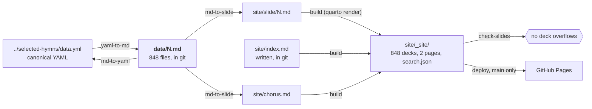
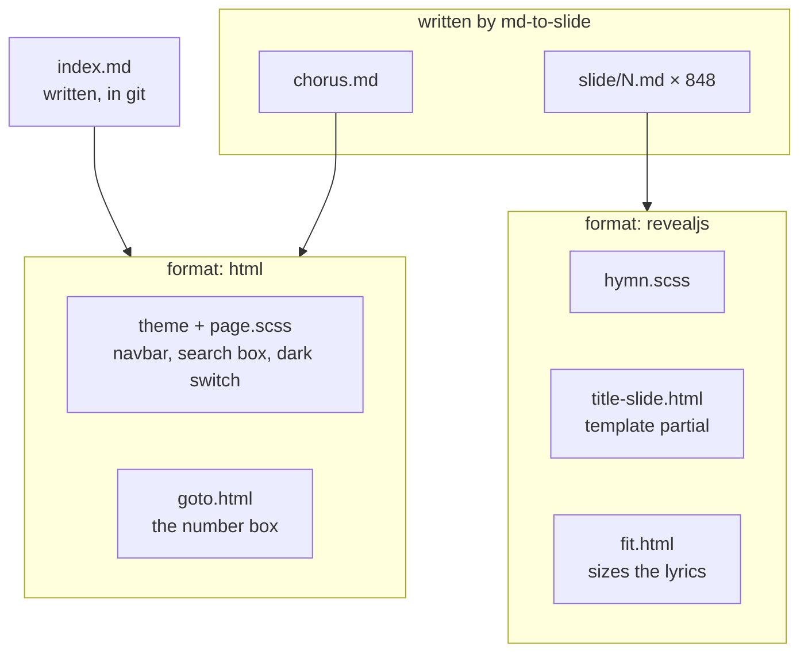

# Developing

Enough to navigate the project. For what the checked-in Markdown means, see
[FORMAT.md](FORMAT.md); for what the site is, see [README.md](README.md). The
files themselves carry the reasoning behind each decision in comments.

## The shape of it

One source, `data/`, and two projections of it: a lossless one back to the
canonical YAML, and a one-way one to slides.



`data/` and `site/index.md` are in git; everything else to the right is
generated, ignored, and rebuilt here and in CI — so it cannot be stale, and
there is no generated file to review in a diff.

## The Python

| module | what it is |
|---|---|
| `model.py` | the validated `Hymn` and the **lossless** codec: YAML ↔ `data/N.md`. Runs Pandoc with the vendored Lua filters. |
| `slides.py` | the **one-way** projection: `Hymn` → slide Markdown, plus the landing page and the chorus report. |
| `converter.py` | the CLI, and the directory-level streaming each direction. |

The two projections are separate on purpose. The codec must round-trip and so
may drop nothing; the slide projection resolves, divides and discards (the
meter goes, stanzas over four lines are divided, `^[…]` instructions leave the
lyric line), and nothing reads it back.

`slides.py` says what is sung, never how it looks: a `lyrics` Div, one
paragraph per lyric line, one language span per translation. Layout is the
theme's business, which is how the same file renders interleaved or — with
`?grid` on the URL — as two aligned columns.

### Why `chorus.md` is generated and `index.md` is not

`chorus.md` *is* the resolution — which chorus each stanza of each hymn takes
— so it is written by `md-to-slide` with the slides it describes, and cannot
disagree with them. Writing it by hand would be transcribing the code's output.

`index.md` is a form and a heading. The one thing on it that belongs to the
collection is the range the number box accepts, and the collection is a printed
book of 848 hymns: `hymns: 848` in `_quarto.yml`, `max=""` in
the page, and `goto.html` reads the range off the field. A constant kept where
the site is configured, named once.

## The site

`site/` is a Quarto project. `site/slide/*.md` is written by `md-to-slide`;
nothing in `site/` edits it. What the rest of `site/` is:



`_quarto.yml` declares both formats, and **every document names the one it
wants in its own front matter.** A Quarto project declaring more than one
format renders every document to all of them otherwise, so each deck would
also be built as a plain page over the top of itself.

| file | kind | used by |
|---|---|---|
| `_quarto.yml` | project and format configuration | everything |
| `page.scss` | Bootstrap theme layer | the two pages |
| `goto.html` | `include-after-body` script | the two pages; drives the number box |
| `hymn.scss` | reveal.js theme | every deck |
| `title-slide.html` | Pandoc **template partial** — replaces reveal's title slide | every deck |
| `fit.html` | `include-after-body` script | every deck; sizes the lyrics |

Only `title-slide.html` is a template. The two `.html` scripts are fragments
appended to the body, each inert on a page that does not carry the markup it
looks for.

The project is a `website` rather than a `default` project for three things:
848 decks share one copy of reveal.js in `site_libs` instead of a 5 MB copy
each; every document is indexed into `search.json`; and the theme carries the
navbar the search box sits in.

### Search

None of this is ours. A `website` project indexes everything it renders into
`search.json`, and the theme puts a search box over that index in the navbar of
every page — so the feature costs a `search:` block and the decision to have a
theme at all.

What matters is the shape of the index: **one entry per slide**, not per hymn.
A half-remembered line therefore finds the hymn *and* opens at the stanza that
sings it, and the results group by hymn with the other matching stanzas behind
"more matches in this document". The two pages are indexed too, so the chorus
report can be found by name.

This is why the html format has a theme rather than `theme: none`: without one
there is no navbar to put the box in, and Quarto finds nothing it recognizes as
content on the two pages, so neither would be in the index.

### When a render will not finish

A render builds each document beside its source and moves the lot into `_site`
at the end, so two renderers over one project will move the same output twice:

```
ERROR: NotFound: rename 'site/chorus.html' -> 'site/_site/chorus.html'
```

naming a file that had just been moved successfully. The second renderer is
usually a `pixi run serve` preview left running in another terminal: it
re-renders on every change, including the ones `md-to-slide` makes at the start
of a build. Stop it and build again — `pixi run clean` clears what the failed
render left beside its sources. CI renders once, from a fresh checkout, and
never meets this.

### Fitting

A fixed font size trades between two failures: lyrics that overflow the slide,
and short stanzas that leave the screen empty. `fit.html` measures every slide
against reveal's fixed logical viewport (1280×720, declared in `_quarto.yml`
and therefore a contract, not a preference) and sets the whole hymn to the
smallest type that fits any of its slides — one size per hymn, so the type does
not jump between stanzas.

It records that size on the document as `data-fit-size`, which is what makes
848 decks checkable without looking at them.

## Checking

Nobody is going to open 848 decks, so two scripts do it instead.

- `scripts/check_slides.py` (`pixi run check-slides`) loads every rendered deck
  in the headless browser Quarto installs, fails on one whose lyrics overflow
  or whose fitting never ran, and reports the decks whose type ended up small
  enough to want a second look at how the stanza was divided.
- `scripts/chorus_report.py` (`pixi run chorus-report`) prints the hymns whose
  chorus the projection had to work out. `--expect 17` fails if that list
  changes, so a new one cannot arrive unseen.

`pixi run test` is the unit suite: `tests/test_conversion.py` covers the
lossless codec, `tests/test_slides.py` the slide projection.

## Tasks

```
yaml-to-md     Render the canonical YAML collection as data/N.md
md-to-yaml     Rebuild the canonical YAML from data/N.md
md-to-slide    Project data/N.md as the slide Markdown and the chorus report
build          Regenerate the projection and render every deck into site/_site
serve          Preview the site on $QUARTO_PORT (8020)
check-slides   Measure every rendered deck in a browser; fail on overflow
chorus-report  List the hymns whose chorus the projection resolves
test           Run the conversion and projection tests
setup-chrome   Install the headless browser check-slides needs
clean          Remove everything the projection and the render generate
```

`yaml-to-md` and `md-to-yaml` are the only tasks that need the canonical
collection checked out beside this repository at `../selected-hymns`.

## Getting set up

Everything is pinned in `pixi.lock`; there is nothing else to install.

```sh
pixi install            # Pandoc, Quarto, Python and the package itself
pixi run test
pixi run serve          # projects the slides and previews the site
pixi run setup-chrome   # ~260 MB, and only check-slides needs it
pixi run check-slides
```

## CI

`.github/workflows/ci.yml`, three jobs:

- **test** — the suite, and the chorus report with `--expect 17`.
- **build** — renders all 848 decks and then measures every one, then uploads
  `site/_site` as the Pages artifact.
- **deploy** — publishes `main` to GitHub Pages. Branches build and are checked
  but never touch the live site.

Actions are pinned to commit SHAs; a tag can be moved to point at new code.
